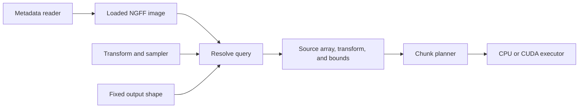

# NGFF images and spatial queries

A spatial query describes a fixed output grid mapped into a reference image.
Metadata loading and query resolution are separate from chunk planning and decoding:



The resolver chooses a source level before the chunk planner reads data. It
also reports whether that source grid can supply the output by copying voxels.
**Execution currently requires an aligned crop.** Rotation, reflection, shear,
fractional offsets, and scaling that remains after level selection require a
future resampling operation. Those queries can be resolved and inspected now;
converting or submitting them raises `UnsupportedOperation` (`DAMACY_UNSUPPORTED`).

## Assemble the stages

This example uses a three-dimensional image with axes ordered `z, y, x`. The
reference array must contain the requested crop. See
[pipeline composition](pipeline.md) for executor limits and batch ownership.

```python
import damacy
import numpy as np

metadata_reader = damacy.FileMetadataReader(concurrency=8)
image = damacy.NgffImage(
    "/data/image.zarr",
    reader=metadata_reader,
    multiscale_index=0,
    limits=damacy.NgffLimits(max_levels=16, max_metadata_bytes=4 << 20),
)
output = damacy.BatchSpec(samples=1, shape=(16, 64, 64), dtype="f32")
query = damacy.SpatialQuery(
    output_to_reference=(
        (1, 0, 0, 8),
        (0, 1, 0, 16),
        (0, 0, 1, 16),
    ),
    sampler=damacy.Sampler(filter="nearest", boundary="error"),
)
resolved = image.resolve(query, shape=output.shape)

planner = damacy.ChunkPlanner(
    metadata=damacy.ZarrMetadata(
        reader=metadata_reader, cache=damacy.MetadataCache()
    ),
    limits=damacy.PlanLimits(),
)
executor = damacy.CpuExecutor(
    reader=damacy.FileReader(workers=4),
    limits=damacy.CpuLimits(max_memory_bytes=256 << 20),
)
with damacy.Pipeline(
    planner=planner,
    executor=executor,
    output=output,
    queues=damacy.QueueLimits(lookahead_samples=8),
) as pipeline:
    pipeline.push([resolved])
    with pipeline.pop() as batch:
        array = np.from_dlpack(batch)
        assert array.shape == (1, 16, 64, 64)
```

`NgffImage` loads the group's `zarr.json` and each level's array metadata once.
It owns an immutable description. `NgffImage.resolve(query, shape=...)` performs
no I/O and can be called from multiple threads. A result owns its source URI
and geometry, so it remains usable after the image is released. Python results
contain ordinary immutable values and can be pickled for transfer between processes.
Source metadata and data must remain unchanged while the image is in use.

Loading is synchronous. It uses only the reader's settings, so one reader can
serve a running pipeline and other loads at the same time.

## Coordinates and the output grid

All public spatial coordinates use **voxel corners**. Voxel index `i` covers
`[i, i + 1)` and has its center at `i + 0.5`. The volume covered by voxel zero
starts at coordinate zero, matching interval and indexed queries. Coordinates
in `output_to_reference` use the highest-resolution level, `image.levels[0]`,
as the reference; they are not physical coordinates.

For rank `N`, the Python transform is an `N × (N + 1)` matrix. Its last column
is the offset. In C, `damacy_affine.linear` and `.offset` represent the same map:

```text
reference_corner = linear * output_corner + offset
```

Rows and columns follow the metadata's array axis order, including time and
channel dimensions. The supplied output shape determines the rank and fixed output grid.
Output centers are the grid points `(j[0] + 0.5, ..., j[N-1] + 0.5)`.
Only spatial axes may mix, rotate, reflect, or scale. Time and channel axes
require identity rows/columns and integral offsets, and must remain in bounds.
Combining spatial resampling with indexed time/channel selections is a later
extension; use `IndexQuery` for current arbitrary index selections.

The spatial linear map must be finite and numerically nonsingular. Validation
normalizes each spatial row by its largest coefficient and eliminates using
the largest remaining pivot. Pivots no larger than `64 * DBL_EPSILON` fail validation. Shapes and
transformed sample coordinates are limited to `2**52 - 1` index units so
half-voxel centers remain representable. Rank, shape, transforms, and sampler
parameters are checked before a resolution is returned. Batch sizing and dtype
conversion are validated by the downstream pipeline. Resolution allocates only
its small description, so the shape need not fit an output buffer at this stage.

## NGFF interpretation

The loader supports the [OME-Zarr 0.5](https://ngff.openmicroscopy.org/0.5/)
`attributes.ome` layout on Zarr v3. Select the `multiscales` entry explicitly
with `multiscale_index`. Supported images have two or three spatial axes and
optional time/channel axes, in the declared order. `dimension_names` must
match those axes at every level. Arrays must use supported numeric Zarr codecs
and a common dtype. Custom/unspecified axis types and transforms stored in
external arrays are currently unsupported.

Dataset transforms must have one positive scale and an optional following
translation. Transforms shared by all levels do not affect reference-level
coordinates and are left uninterpreted.
Levels must have nondecreasing scales and nonincreasing shapes along each
axis; nonspatial transforms and shapes must be unchanged. Paths must be
relative child paths. Axis units are retained as declared; no physical-unit
conversion or inference is needed for reference-level queries.

Parsing checks the fields needed for array layout and coordinate interpretation,
including duplicate consumed fields and finite, correctly sized transforms.
Unselected multiscale entries and additional attributes are left uninterpreted.
Unused subtrees and trailing content may remain unexamined; these calls do not
perform whole-document JSON validation.

NGFF uses center-origin coordinates, as described in its
[coordinate convention](https://ngff.openmicroscopy.org/rfc/5/#coordinate-convention).
The adapter derives a corner-origin map once while loading metadata. If the
NGFF center-index map at level `l` is `p = S_l * i_l + T_l`, then:

```text
R_l = S_l / S_0
origin_l = (T_l - T_0) / S_0 + (1 - R_l) / 2
reference_corner = R_l * level_corner + origin_l
```

These calculations are componentwise. A transform shared by every level
cancels when mapping to reference-level indices. Level zero is exactly the
identity. For a 2× level with a half-reference-voxel center translation,
`origin_l` is zero. A scale-only 2× level instead has `origin_l = -0.5`;
Damacy preserves that declared alignment. The API never asks callers to add
or remove NGFF center offsets themselves.

Writers usually compute scales and translations in floating point, so these
values can miss by a rounding error. For example, scales `0.1` and `0.3` give
`R_l = 2.9999999999999996`. Loading replaces `R_l` or `origin_l` with the
nearest multiple of 1/256 when it is that close: within `64 * DBL_EPSILON`
times `R_l` for the ratio, or times `(|T_l| + |T_0|) / S_0 + R_l` for the
origin. Whole-number ratios and whole- or half-voxel origins then come out exact.

`NgffLevel.scale_to_reference` and `.origin_reference_index` expose this
adapted map. Given query matrix `A` and offset `b`, resolution computes:

```text
output_to_source.linear = inverse(R_l) * A
output_to_source.offset = inverse(R_l) * (b - origin_l)
```

## Choosing a level

`SpatialQuery.level` defaults to `"auto"` (`DAMACY_LEVEL_AUTO` in C). The
resolver selects the coarsest level whose spacing is no coarser than the
requested output spacing in any spatial direction. It tests the smallest
singular value of `inverse(R_l) * A`, restricted to spatial axes, against one.
The comparison allows `64 * DBL_EPSILON` for numerical error. If no level
qualifies, it selects level zero for upsampling. Rotation, anisotropic scale,
and shear are included in this calculation. Source position, boundary mode,
and decoder capabilities do not change the level choice.

An explicit nonnegative level index overrides that policy. A bad index fails;
there is no fallback from a requested level. For an aligned crop of level `l`
beginning at index `beg`, use the level's scale as the query's diagonal linear
map and `origin_l + R_l * beg` as its offset.

The current copy path requires the resolved linear map to equal identity,
its offsets to be integral, and its source bounds to be inside the array.
The resolver checks this exactly and never rounds a query into a crop. Because
loading removes rounding error from the level values, a crop built from them
as above is exact. A query computed another way, such as from physical
coordinates, can still be off by a rounding error and then require resampling.
`requires_resampling` reports this, and `Pipeline.push()` rejects such results
until a resampler is available. The pipeline checks the resulting shape against
its own `BatchSpec`.

## Sampler and bounds

Each spatial query carries a `Sampler`. Its current point filters are:

| Filter | Source indices contributing at corner coordinate `s` |
| --- | --- |
| `nearest` | `floor(s)`; a tie on a voxel boundary selects the larger index |
| `linear` | `floor(s - 0.5)` and `ceil(s - 0.5)`, combined across spatial axes |

Linear interpolation omits neighbors with zero weight. These definitions also
apply to negative coordinates. No additional antialias filter is currently
specified; choosing a pyramid level uses the downsampling already present in
the image, whose construction is outside the sampler's control.

| Boundary | Interpretation |
| --- | --- |
| `error` | Reject if any contributing index is outside the source |
| `constant` | Extend the source with the finite `constant_value` |
| `clamp` | Replace each out-of-range spatial index with the nearest edge index |

`constant_value` must be zero unless the boundary is `constant`. Filter and
boundary enums have no valid zero value in C. Unknown settings fail validation.
Boundary rules apply to the chosen source level, not the reference array.

`source_bounds_index` is a half-open integer box enclosing all source indices
that contribute to the output, before boundary handling. `read_bounds_index`
accounts for boundary handling: constant extension clips to the array, while
clamp includes the touched edge voxels. Empty read intervals are valid for
constant-only outputs. The bounds include interpolation support. They are
conservative boxes around transformed crops, not a list of exact touched chunks.
Boundary sampling currently requires resampling and cannot be decoded yet.

## Public C API

Include `damacy_spatial.h` alongside the pipeline API. A two-dimensional
identity crop can be resolved and pushed as follows; `pipeline` must already
have matching output geometry and an executor:

```c
struct damacy_metadata_reader* reader = NULL;
struct damacy_ngff_image* image = NULL;
struct damacy_spatial_resolution resolved = {0};
struct damacy_ngff_limits limits = {
  .max_levels = 16, .max_metadata_bytes = 4 << 20
};
const int64_t output_shape[] = {64, 64};
struct damacy_spatial_query query = {
  .output_to_reference = {
    .linear = {{1, 0}, {0, 1}}, .offset = {16, 24}
  },
  .sampler = {
    .filter = DAMACY_FILTER_NEAREST, .boundary = DAMACY_BOUNDARY_ERROR
  },
  .level = DAMACY_LEVEL_AUTO
};
struct damacy_sample sample;
enum damacy_status status =
  damacy_file_metadata_reader_create(8, NULL, &reader);
if (status == DAMACY_OK)
  status = damacy_ngff_image_load(reader, "/data/image.zarr", 0, &limits, &image);
if (status == DAMACY_OK)
  status = damacy_spatial_resolve(image, &query, 2, output_shape, &resolved);
if (status == DAMACY_OK)
  status = damacy_spatial_resolution_sample(&resolved, &sample);
if (status == DAMACY_OK) {
  struct damacy_push_result pushed = damacy_push(
    pipeline, (struct damacy_sample_slice){.beg = &sample, .end = &sample + 1});
  status = pushed.status;
}
damacy_spatial_resolution_clear(&resolved);
damacy_ngff_image_destroy(image);
damacy_metadata_reader_destroy(reader);
```

A production caller must retry the unconsumed suffix when `damacy_push` returns
`DAMACY_AGAIN`, keeping the sample's owner alive until acceptance or abandonment.
The example releases it on return. Accepted pushes copy the URI and selectors.
The C result is a caller-owned `damacy_spatial_resolution` value with directly
readable fields. It owns its URI independently of the image. Treat the fields as
read-only and call `damacy_spatial_resolution_clear()` before reusing or discarding
the result. A plain struct copy borrows the same URI; clear only the owning
value. Clear frees the URI and zeros the value; repeating it is safe.
Resolution zeros its output on failure. Zero-initialized results can be cleared.

`damacy_spatial_resolution_sample()` is the compatibility bridge to the existing
C push API. Its sample borrows the result's URI and its output is zeroed on
failure. Keep the result alive until the sample is accepted or abandoned.
The image info accessor returns a borrowed, immutable view. C affine entries
outside the configured rank are unused.

`max_metadata_bytes` bounds the sum of input JSON file sizes; files exceeding
the remaining budget are rejected before allocating or reading their contents.
`max_levels` separately bounds the number of level records. Exhaustion returns
`DAMACY_BUDGET`. Metadata loading performs no chunk reads and requires no GPU.

## Next execution step

A later planner operation can consume the owned resolution directly, group
source chunks needed by each output tile, and preserve the transform and
sampler in the prepared plan. CPU resampling needs a bounded decoded working
set and all contributing chunks available before writing a tile. CUDA can
implement the same operation after that contract is tested. Neither executor
should interpret NGFF or choose a pyramid level. Additional filters and
antialiasing parameters belong on the query's sampler when implemented.
